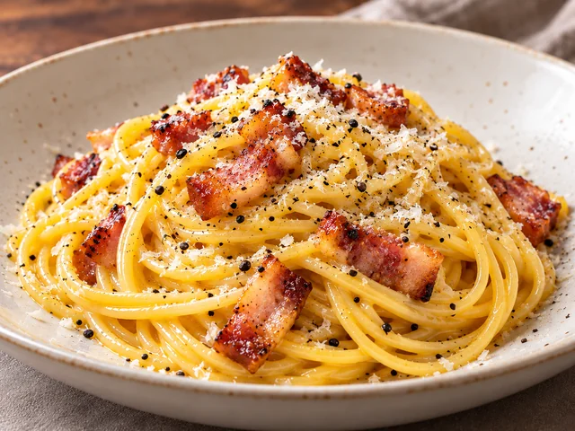

# Carbonara

A simple carbonara made without cream, using eggs, Parmesan, and bacon for a silky, savory sauce.

- Servings: 2
- Categories: Main dish, Pasta

## Ingredients

- Spaghetti — 180 g
- Bacon — 100 g
- Eggs — 2
- Egg yolk — 1
- Parmesan cheese — 50 g
- Coarsely ground black pepper — 1/2 tsp, plus more to finish
- Water — 2 L
- Salt — 1 tbsp

## Directions

1. Bring 2 L of water to a boil, add the salt, and cook the spaghetti for 1 minute less than the package directions. Reserve 150 ml of pasta water, then drain the pasta.
2. Cut the bacon into 1 cm strips and cook it in a pan over medium-low heat for 4 to 5 minutes, until the fat renders and the edges are lightly crisp. Turn off the heat.
3. Whisk the 2 eggs, egg yolk, 40 g of Parmesan, and 1/2 tsp black pepper in a bowl until combined. Reserve the remaining 10 g Parmesan for finishing.
4. Add the drained spaghetti to the pan with the bacon and toss for about 30 seconds. Remove the pan completely from the heat and let it cool for about 30 seconds.
5. Pour in the egg and cheese mixture and toss quickly. Add the reserved pasta water 1 tbsp at a time, about 2 to 4 tbsp total, until the sauce is glossy and clings smoothly to the pasta.
6. Plate immediately and finish with the reserved Parmesan and a little more black pepper.

---

The canonical data for this recipe is [recipe.json](recipe.json).
