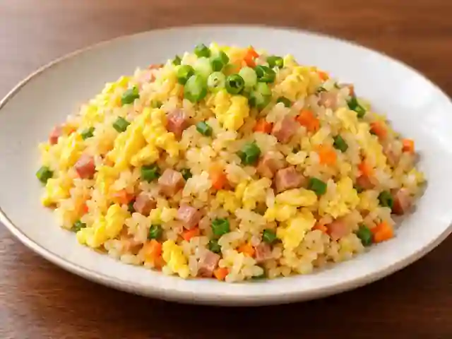

# Golden Egg Fried Rice

A fluffy, golden Chinese-style egg fried rice adapted for home cooking from Chef Lee Yeon-bok's golden fried rice technique.

- Servings: 2
- Categories: Rice Bowl, Chinese

## Ingredients

- Microwave-ready rice — 2 packs (210g each)
- Eggs — 3
- Spam luncheon meat — 50g
- Carrot — 1/2 (about 70g)
- Scallion — 1/2 stalk (about 40g)
- Powdered chicken stock — 2 tsp
- Neutral cooking oil — 2 tbsp
- Water (to blanch Spam) — 500ml

## Instructions

1. Loosen the lids of the rice packs and microwave for about 30 seconds, just enough to make the grains easier to separate.
2. Finely dice the Spam, then blanch it in 500ml boiling water for about 30 seconds and drain. Finely chop the carrot and scallion.
3. Beat the 3 eggs in a large bowl. Add the briefly warmed rice and use a spatula to break up clumps, coating each grain evenly with beaten egg.
4. Mix the carrot, Spam, scallion and powdered chicken stock into the egg-coated rice until evenly distributed.
5. Add 2 tablespoons of oil to a skillet and heat over medium heat. Add all of the prepared rice mixture.
6. Stir-fry continuously for 4 to 6 minutes, until the eggs are fully cooked and the rice grains are separate and fluffy. Transfer to plates.

---

The canonical data for this recipe is [recipe.json](recipe.json).
