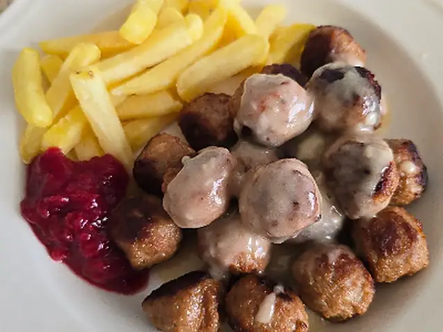

# Swedish Meatballs (Köttbullar)

Swedish-style meatballs made with beef and pork, served with creamy gravy, lingonberry jam, and French fries.

- Servings: 2
- Category: Main Dish

## Ingredients

- Ground beef — 200g
- Ground pork — 100g
- Onion — 1/4 (about 50g)
- Breadcrumbs — 3 tbsp (about 15g)
- Milk — 60ml
- Egg — 1
- Salt — 1/2 tsp
- Black pepper — 1/4 tsp, plus a little for the gravy
- Ground allspice — 1/4 tsp
- Cooking oil — 1 tbsp
- Butter — 2 tbsp (about 30g)
- All-purpose flour — 1 tbsp (about 10g)
- Beef stock — 200ml
- Heavy cream — 100ml
- Soy sauce — 1 tsp
- Dijon mustard — 1 tsp
- Frozen French fries — 300g
- Lingonberry jam — 4 tbsp (about 60g)

## Directions

1. Mix the breadcrumbs with 60ml milk and let them soak for about 5 minutes. Finely mince 1/4 onion.
2. Add the ground beef, ground pork, soaked breadcrumbs, minced onion, egg, 1/2 tsp salt, 1/4 tsp black pepper, and 1/4 tsp allspice to a bowl. Mix just until evenly combined.
3. Shape the mixture into 18 to 20 bite-size meatballs, about 3cm across. Cook the frozen French fries in an oven or air fryer according to the package directions until golden.
4. Heat 1 tbsp cooking oil and 1 tbsp butter in a skillet over medium heat. Add the meatballs and cook for 7 to 9 minutes, turning them to brown evenly and cook through. Transfer them to a plate.
5. Reduce the heat to medium-low. Add the remaining 1 tbsp butter and the flour to the same skillet and stir for about 1 minute. Gradually pour in the beef stock while stirring until smooth.
6. Add the heavy cream, soy sauce, Dijon mustard, and a little black pepper. Simmer for 3 to 4 minutes, stirring, until the gravy is smooth and lightly thickened.
7. Return the meatballs to the gravy and warm them over low heat for about 2 minutes, turning to coat. Serve with the French fries and lingonberry jam.

---

The canonical data for this recipe is [recipe.json](recipe.json).
