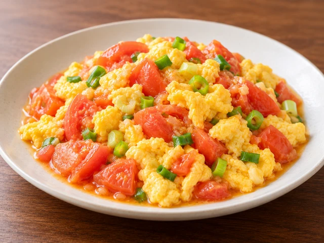

# 토마토계란볶음

이연복 셰프의 조리법을 참고해 토마토의 아삭함과 달걀의 부드러움을 함께 살린 중식 토마토계란볶음입니다.

- 분량: 2인분
- 분류: 메인 반찬, 중식

## 재료

- 토마토 — 2개(약 300g)
- 달걀 — 5개
- 치킨스톡(액상) — 1스푼
- 식용유 — 2스푼
- 대파 — 1/4대
- 물(토마토 데치기·헹구기용) — 적당량

## 조리 방법

1. 토마토 2개는 꼭지를 떼고 밑부분에 십자 모양으로 얕게 칼집을 냅니다. 끓는 물에 살짝 데쳐 껍질이 벌어지면 건져 냅니다.
2. 볼에 달걀 5개를 풀고 액상 치킨스톡 1스푼을 넣어 잘 섞습니다.
3. 데친 토마토를 찬물에 헹구고 껍질을 벗깁니다. 작게 썰어 달걀물에 넣고 섞습니다.
4. 대파 1/4대를 잘게 썰어 토마토가 든 달걀물에 넣고 고루 섞습니다.
5. 팬에 식용유 2스푼을 두르고 중불로 달군 뒤 달걀물을 붓습니다. 처음부터 마구 젓지 말고 달걀이 익기 시작하면 나무주걱으로 가장자리에서 가운데로 살살 밀어주며 익힌 뒤, 큰 덩어리를 뒤집어 반대쪽도 익힙니다.
6. 달걀이 완전히 익고 토마토는 약 70~80%만 익어 아삭함이 남아 있을 때 불을 끄고 접시에 담습니다.

## 참고 영상

이연복 셰프의 원본 레시피: https://youtu.be/e8rPgeVUP68

---

The canonical data for this recipe is [recipe.json](recipe.json).
